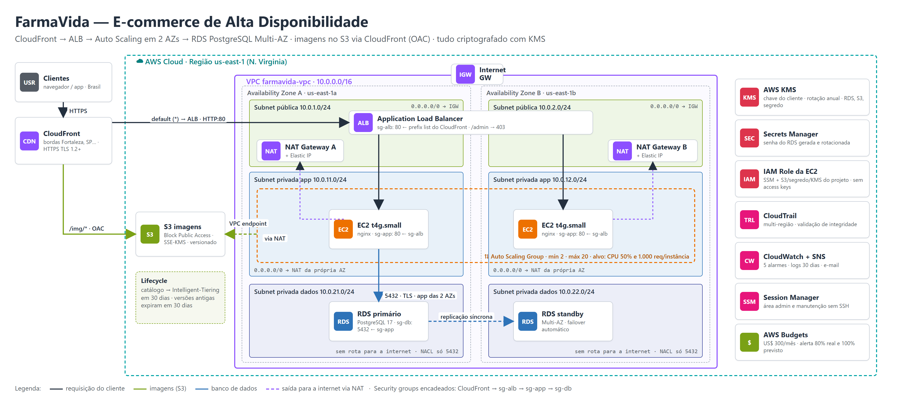

# FarmaVida — e-commerce de alta disponibilidade na AWS com Terraform

Arquitetura de um e-commerce que **não cai nos picos** (10× o tráfego normal na Black Friday), **paga menos fora deles** e **protege os dados dos clientes** (LGPD), descrita inteira em Terraform.

Projeto final da disciplina **Computação em Nuvem** da Pós-Graduação em Engenharia de Software com foco em DevOps (UNIFOR, 2026.2).



## O cenário

A FarmaVida é uma rede fictícia de farmácias com 120 lojas no Nordeste. O e-commerce rodava em um único servidor alugado e caiu duas vezes na última Black Friday. A diretoria pediu três coisas: não cair nos picos, pagar menos fora deles e proteger os dados dos clientes.

## A solução

| Camada | Serviço | Por quê |
|---|---|---|
| Borda | CloudFront | HTTPS perto do cliente (bordas em Fortaleza, Rio, São Paulo) e cache das imagens |
| Entrada | Application Load Balancer | Só aceita tráfego do CloudFront (prefix list gerenciada); `/admin` bloqueado |
| Aplicação | EC2 Graviton + Auto Scaling (2 a 20) | Uma instância por AZ no mínimo; escala por CPU e por requisições |
| Dados | RDS PostgreSQL 17 Multi-AZ | Standby síncrono na outra AZ, failover automático, PITR de 7 dias |
| Imagens | S3 + Origin Access Control | Bucket privado, lido só pela distribuição do CloudFront |
| Rede | VPC em 3 camadas × 2 AZs | Públicas (ALB, NAT), app (privada, sai pelo NAT da própria AZ), dados (sem rota para a internet) |
| Segurança | KMS, Secrets Manager, IAM Role, CloudTrail, Session Manager | Chave do cliente com rotação, senha do banco fora do código, sem access keys, sem SSH |
| Operação | CloudWatch + SNS, AWS Budgets | 5 alarmes, logs, alerta de custo |

Security groups encadeados: **CloudFront → sg-alb → sg-app → sg-db**, cada regra referenciando a camada anterior. A camada de dados tem ainda uma NACL que só deixa passar 5432 vindo das subnets de aplicação.

## Estrutura

```
infra/terraform/
  rede.tf             VPC, 6 subnets em 2 AZs, IGW, NAT por AZ, rotas, NACL, endpoint S3
  seguranca.tf        security groups, KMS, IAM role da EC2, CloudTrail
  armazenamento.tf    S3 (BPA, versionamento, SSE-KMS, lifecycle) e RDS Multi-AZ
  computacao.tf       launch template, ALB, Auto Scaling Group e políticas de escala
  cdn.tf              CloudFront com duas origens (S3 via OAC e ALB)
  observabilidade.tf  alarmes, logs, SNS e AWS Budgets
app/user_data.sh      nginx que mostra qual instância e AZ atenderam a requisição
docs/                 documento de arquitetura (PDF) e evidências do terraform plan
```

## Como usar

```bash
cd infra/terraform
cp terraform.tfvars.example terraform.tfvars   # grupo e owner (e-mail dos alertas)
terraform init
terraform plan                                 # 76 recursos
terraform apply                                # ~20 min (RDS Multi-AZ e CloudFront são os mais lentos)
terraform output url_loja
```

Para destruir, desligue antes a proteção do banco (`deletion_protection = false` em `armazenamento.tf`, `terraform apply`) e então `terraform destroy`. Com `skip_final_snapshot = false` fica um snapshot final, que deve ser apagado à parte se não for necessário.

> O ambiente foi **validado com `terraform validate` e `terraform plan`** contra uma conta AWS real (evidência em [`docs/evidencias`](docs/evidencias)), mas não foi mantido no ar: NAT Gateways, ALB e RDS Multi-AZ cobram por hora.

## Custos

[Estimativa pública no AWS Pricing Calculator](https://calculator.aws/#/estimate?id=e2d869487caa3e3ed607fda5c95d65d5f94e26eb) (us-east-1, On-Demand):

| Cenário | Custo |
|---|---|
| Mês normal | **US$ 223,49** |
| Mês da Black Friday (até 20 instâncias por 72 h) | ≈ US$ 295 |
| Com 1 NAT, Savings Plan e RDS reservado | ≈ US$ 166 (−25%) |
| Ligado só para estudo (custo fixo por hora) | ≈ US$ 0,25/h |

O maior item é o NAT Gateway (~31%), preço de manter uma saída para a internet por AZ. Tags de custo (`Projeto`, `Grupo`, `Ambiente`, `Owner`) vão em todos os recursos pelo `default_tags` do provider, e o Budget alerta a 80% do real e 100% do previsto.

## Decisões e limitações

- **us-east-1 em vez de São Paulo:** a mesma arquitetura em sa-east-1 sairia ~60% mais cara; a latência das páginas dinâmicas é compensada pelo CloudFront. A transferência internacional de dados pessoais exige base legal pela LGPD (cláusulas-padrão, já presentes no DPA da AWS).
- **TLS:** cliente → CloudFront e aplicação → banco cifrados; o trecho CloudFront → ALB fica em HTTP até haver domínio próprio com certificado ACM.
- **Próximos passos:** domínio + ACM + WAF no CloudFront, teste de carga demonstrando o Auto Scaling, RDS Proxy/read replica para o checkout em pico e cópia de snapshots para outra região.

O documento de arquitetura completo, com matriz de decisão de provedor, ADR, topologia de rede, IAM, RPO/RTO, FinOps e Well-Architected, está em [`docs/DOCUMENTO_ARQUITETURA.pdf`](docs/DOCUMENTO_ARQUITETURA.pdf).

## Equipe ADDR

Alexandre Morlin · Daniel Azevedo · Dheyme Sena · Rafael Oliveira

Disciplina Computação em Nuvem — Prof. Bruno Cavalcanti · Pós-Graduação UNIFOR 2026.2
